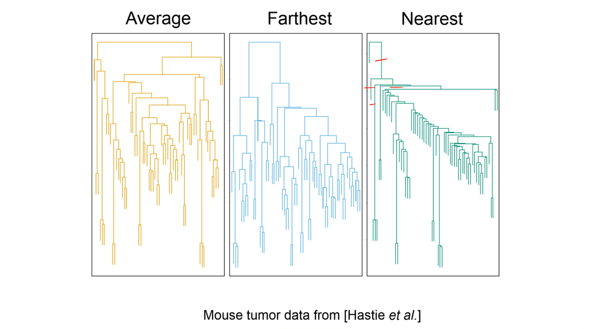

# Why does k-means++ work?

- Consider a cluster C that OPT uses. If we select a point from there then that cluster is covered "pretty well".
  - cost incurred by our center is with some constant * cost incurred by OPT.

- If we select two points from the same OPT cluster, it must be because the contribution of other clusters to the OPT cost is small.

### Parallelizing K-means

- Suppose the data is distributed on multiple machines.
- So can we parallelize K-means??

- Partition the data,
  - Let $X_1, X_2, .... , X_p$ be the partitions.

- In parallel compute a clustering for each $X_i$
  - $C_1^i,....,C_1^k$ be the clustering, define $W_i^j = |C_i^j|$

- Consider the cluster centroids as points with weights $W_i^j$ and then recluster them.

``` Note
The weight is equal to number of points associated with the center $C_i$ in a cluster.
```
#### Example

- Let there are four machines and we want to run k-means algorithm.

- Therefore, we let each machine run k-means on their data set and come up with k centers. (Phase 1)

- we will assign these k centers their weight which will be equal to the number of points associated with that particular center.

- Therefore, we have 4k centers and now we can shift these to one center cluster and run k means algorithm on these 4k points. (Phase 2)

#### So how good is the solution?

- Suppose the algorithm in phase 1 gave a $\beta$ approximation solution and the algorithm in phase 2 gave $\gamma$ approximation solution.

- **Theorem (GNMO00, AJM09)**: Overall we get a 4$\gamma(1+\beta)$ + 2$\beta$ approx.

- **Setting** $\beta = \gamma$ = O(logk) would give a O$(logk)^2$ approx.

### Hierarchical clustering

- k-means/K-median worked on the intuition that clusters are "balls" in high dimension.

- Also we have to know the number of centers we are working with.

- So what can we do when we do not know the target number of clusters?

- can we produce a family of clustering, for each k?


- There are two ways-

1. Top-down/divisive: Keep on creating bi-partition (applying 2-means)
2. Bottom-up/agglomerative: start from individual point and keep on aggregating.

### Divisive clustering

- This is a top-down clustering approach, initially all the data points belong to one cluster and then keep on creating bi-partition recursively (applying 2-means)

### Agglomerative clustering

- This is bottom-up clustering approach, initially each data point is a cluster of its own, then keep on merging closest set of data points to build larger clusters from smaller ones.

**Algo:**

    - keep a current list of clusters
    - Initially, each point in its own cluster
    - while #clusters>1:
        - choose closest pair
        - merge them,
        - update list by deleting these and adding new cluster.

> But how do we define closest pair or the closeness between two clusters?

There can be many ways, some of them are-

1. Closest pair: single linkage clustering -> $d_1$(C,C') = $\underset{x \epsilon C,y \epsilon C'}{min}$ d(x,y)

2. Furthest pair: complete link clustering -> $d_2$(C,C') = $\underset{x \epsilon C,y \epsilon C'}{max}$ d(x,y)

3. Average of all pairs: average link      -> $d_3$(C,C') = $\underset{x \epsilon C,y \epsilon C'}{avg}$ d(x,y)



